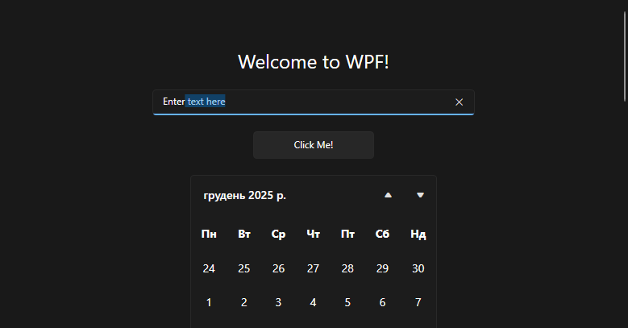

# PresentationFramework.Fluent#NET48

**PresentationFramework.Fluent#NET48** is a port of the Fluent theme from .NET 9+ to **.NET Framework 4.8**. The goal of this project is to provide a minimalist implementation of Fluent styles for standard WPF elements on the legacy Framework 4.8. Only the essentials, nothing extra.

You can get the Nuget package at [this link](https://www.nuget.org/packages/PresentationFramework.Fluent).

    dotnet add package PresentationFramework.Fluent --version 1.0.0

## Overview

The Fluent theme is known in **.NET 9+** as the modern **Windows 11** theme, featuring transparent elements, smooth animations, and a contemporary UI design. In the original version, many resources and styles use internal types and resource components (`ComponentResourceKey`) that are not directly supported in **Net Framework 4.8**. These have been replaced with analogs or commented out (see `TODO`). This port also provides all styles separately, allowing you to combine them across different elements. 



#### This port:

- Porting core styles for **Window, Button, TextBox, ComboBox, Calendar, DataGrid**, and other standard elements. 
- Replaces internal keys with **public resources** available at runtime in Net Framework 4.8.
- Supports **DynamicResource** and **StaticResource** for colors, **Brushes**, and **ControlTemplates**. 
- Allows connecting the Fluent theme as an external **ResourceDictionary** or integrating it into your `App.xaml`.
  
## Features

- ✅ Fully functional styles for WPF elements on **.NET Framework 4.8**.
- ✅ **4** themes available to choose from: `Fluent.Light`, `Fluent.Dark`, `Fluent`, and `Fluent.HC` (High Contrast). 
- ✅ Support for **HighContrast** mode via `SystemParameters.HighContrast`.
- ✅ Easy integration into your project:

**App.xaml** — required if you plan to use the `Designer`. 
  ```xaml
  <Application.Resources>
      <ResourceDictionary>
          <ResourceDictionary.MergedDictionaries>
              <ResourceDictionary Source="/PresentationFramework.Fluent;component/Themes/Fluent.Dark.xaml"/>
          </ResourceDictionary.MergedDictionaries>
      </ResourceDictionary>
  </Application.Resources>
  ```
  **YourWindow.xaml** — required if you want the window background to be automatically applied from the theme.
  ```xaml
  <Window x:Class="YourNamespace.MainWindow"
          xmlns="http://schemas.microsoft.com/winfx/2006/xaml/presentation"
          xmlns:x="http://schemas.microsoft.com/winfx/2006/xaml"
      Title="YourWindow" Style="{StaticResource DefaultWindowStyle}">
  </Window>
  ```
  
---

### ⛔ What is not supported:

As mentioned above, some resource components available only in **NET 9+** are not supported. Additionally, the port does not support:

-   ❌ Auto-detection of system theme
-   ❌ Auto-detection of system colors
-   ❌ Automatic changes to the **TitleBar** and **SystemContextMenu** according to the theme
    

See the next section for a possible solution to these issues.
  
## 💡 Usage with DarkNet
 
The **Title Bar** and **Context Menu** styling still doesn’t fully match the default .NET 9.0+ look. Yeah, it's a pain. One workaround is to use the **[DarkNet](https://github.com/Aldaviva/DarkNet?tab=readme-ov-file#wpf)** lib. It features a `SkinManager` that allows you to define Fluent themes as follows:

**YourWindow.xaml.cs**

  ```C#
	public MainWindow()
	{
	    InitializeComponent();

	    new SkinManager().RegisterSkins(
	        lightThemeResources: FluentHelper.LightThemeUri,
	        darkThemeResources: FluentHelper.DarkThemeUri);

	    DarkNet.Instance.SetWindowThemeWpf(this, Theme.Auto);
	}
  ```
  

